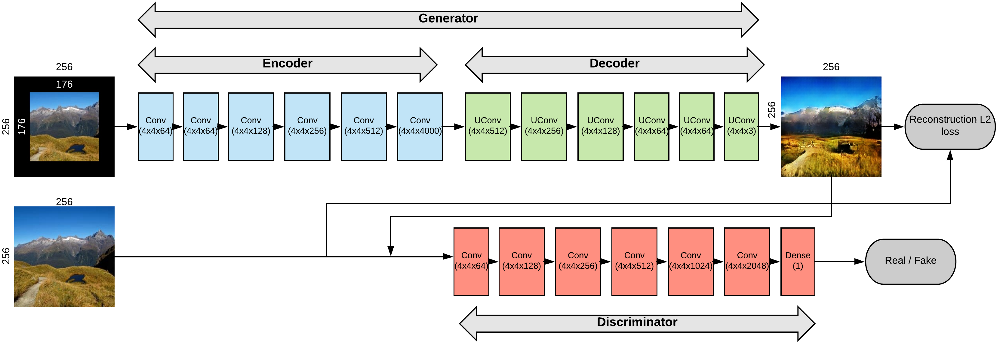
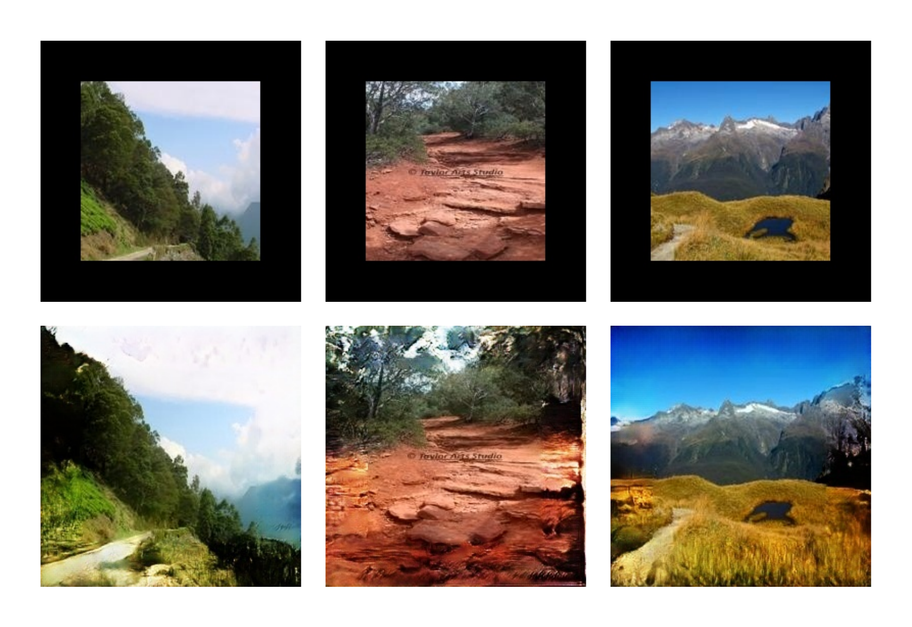

# Photo Uncrop

This repository contains code and usage instructions for our COMS 4731 project.

## Description
The goal of this project is to build a model that extrapolates cropped images of outdoor scenes. We use an encoder-decoder architecture to capture contextual information from input cropped images and generate an extrapolated image based on the context. We also use a Generative Adversarial Network in conjunction with the encoder-decoder framework to obtain highly detailed results. Finally, we use a post-processing technique called seamless cloning on the generated output to further improve the quality of the results. The complete model architecture is shown below:

<p align="center">

</p>

## Dependencies
We developed the code using Tensorflow for python 2 in Anaconda. Also the following packages need to be installed:

* OpenCV 
* Pandas
* Numpy
* Ipdb
* Scikit-Image

For both training and testing, we used a Google cloud instance with an NVIDIA Tesla P100 GPU.

## Dataset
We used the following 10 classes of outdoor scenes from the [Places dataset](http://places2.csail.mit.edu/index.html): Butte, corn-field, desert, desert-road, farm, field-road, hay-field, mountain-path, pasture, sky. 
</br>
To prepare the dataset, download the train and validation set under "Small images (256 * 256)" from http://places2.csail.mit.edu/download.html. Extract into folders and remove all classes other than the 10 required ones. We use the train set for training and the validation set for testing.

## Usage instructions
All code is housed in the `src/` folder.
### Training
To train the model with mask reconstruction loss:
```
python train_mask.py
```

To train the model with unmask reconstruction loss:
```
python train_unmask.py
```
Each of these scripts trains the model on the training set and saves the model weights at the end of each epoch. It also generates output for 50 test images and saves it every 500 iterations.

### Testing
To generate test results using a trained model with mask reconstruction loss:
```
python test_mask.py
```
To generate test results using a trained model with unmask reconstruction loss:
```
python test_unmask.py
```
Each of these scripts generates the raw output for all test images and saves it along with the ground-truth images.

### Post-processing
To generate the overlayed and seamless cloned output:
```
python post-proc.py
```
Path to input and raw output images need to be specified in the script.
### Evaluation
To compute values for the evaluation metrics on the test set:
```
python eval.py
```
Path to ground-truth and generated images need to be specified in the script.

## Pre-trained model
Our trained models can be downloaded from here (Lionmail access only):

* Mask reconstruction loss: https://drive.google.com/open?id=1NpoMKJXmJMkEq4kAeNlRJtgqHHqXfn6B
* Unmask reconstruction loss: https://drive.google.com/open?id=1K5vag1yXdrgDxjSKIRNH4w1ovnTYPNFn

## Sample results
Below are some results from the test set. The top row is the cropped input image and the bottom row is the post-processed output.

<p align="center">

</p>

## References

* Project paper - [report.pdf](docs/report.pdf)
* Context Encoders: Feature Learning by Inpainting - https://arxiv.org/abs/1604.07379
* Tensorflow implementation of the paper above - https://github.com/jazzsaxmafia/Inpainting
* Seamless cloning - https://docs.opencv.org/3.0-beta/modules/photo/doc/cloning.html
